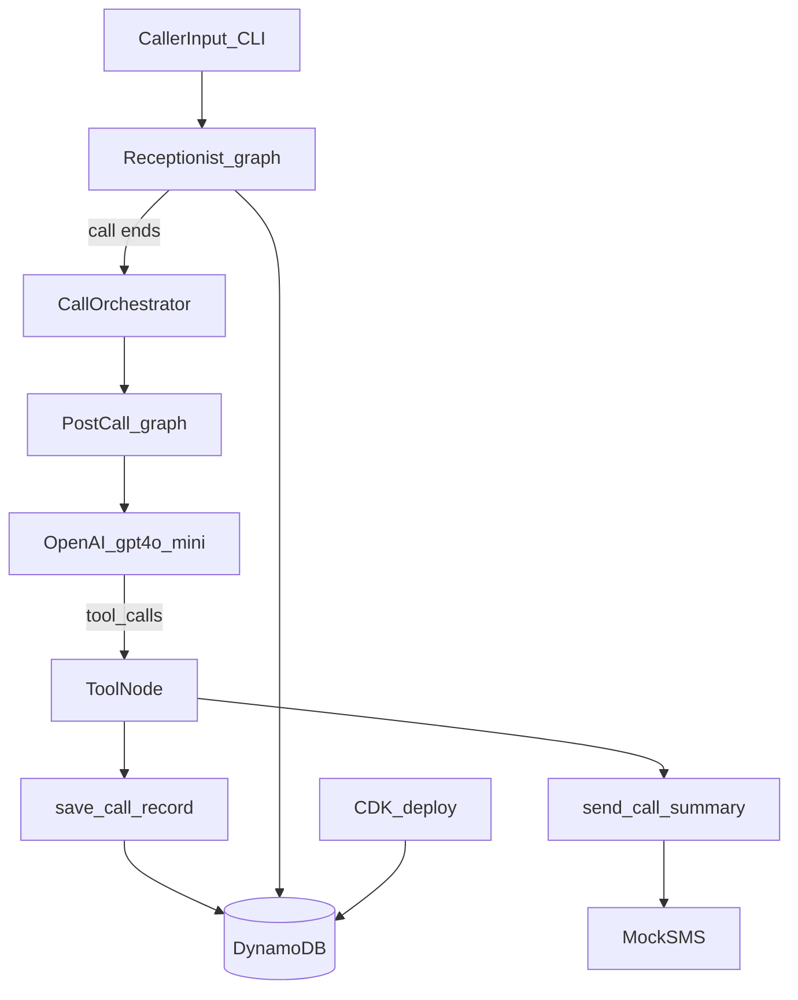

# Mira — Managed Inbound Reception Assistant

**Mira answers when you can't.**

Mira is an agentic AI phone receptionist for small trades businesses (HVAC, plumbing, etc.). The foundation delivers a Python CLI demo with LangGraph orchestration, OpenAI tool calling, DynamoDB persistence (via AWS CDK), and eval scenarios. **Iteration 2** adds a multi-agent post-call pipeline.

## Architecture



### Agent 1 — Receptionist (live call)

- LangGraph loop: `agent → tools → sync → notify → agent`
- Tools: `lookup_business`, `save_lead`, `end_call`
- Supervisor routes emergency + address to owner alert

### Agent 2 — Post-call (after hang-up)

- LangGraph loop: `agent → tools → sync → agent`
- Tools: `save_call_record`, `send_call_summary`
- Saves transcript + summary to `call_records`, sends owner follow-up SMS

## Stack

| Layer | Choice |
|-------|--------|
| LLM | OpenAI `gpt-4o-mini` |
| Orchestration | LangGraph |
| Observability | LangSmith |
| Data | DynamoDB (CDK-provisioned) |
| Infra | AWS CDK (TypeScript) |
| Interface | CLI + FastAPI + Twilio Voice |

## Phone demo (Twilio Voice)

Call a real phone number and talk to Mira. One Twilio number serves three demo businesses via IVR:

| Keypad | Business |
|--------|----------|
| 1 | Dave's HVAC |
| 2 | Pest Pros |
| 3 | Mike's Plumbing |

### Setup

1. **Twilio account** — [twilio.com](https://www.twilio.com): buy a voice-capable phone number.
2. **Env vars** in `.env`:

```bash
TWILIO_ACCOUNT_SID=...
TWILIO_AUTH_TOKEN=...
TWILIO_PHONE_NUMBER=+1...
MIRA_PUBLIC_URL=https://your-ngrok-url.ngrok-free.app
```

3. **Expose the API** — either deploy with CDK (recommended) or run locally with ngrok:

**Option A — CDK deploy (production demo):**

```bash
# .env must include OPENAI_API_KEY, Twilio vars, etc.
cd infra
npm install
npx cdk deploy
# copy ApiFunctionUrl from stack outputs → Twilio webhooks (step 4)
```

**Option B — local + ngrok:**

```bash
source .venv/bin/activate
pip install -e ".[dev,api]"
uvicorn api.main:app --host 0.0.0.0 --port 8000

# another terminal
ngrok http 8000
# copy the https URL into MIRA_PUBLIC_URL
```

4. **Twilio Console** → Phone Numbers → your number → Voice configuration:
   - **A call comes in:** Webhook `POST` → `{MIRA_PUBLIC_URL}/twilio/voice/incoming`
   - **Call status changes:** Webhook `POST` → `{MIRA_PUBLIC_URL}/twilio/voice/status` (runs post-call on hang-up)

5. **Seed tenants** (if not already): `python scripts/seed.py`

6. **Restart uvicorn** after changing `MIRA_PUBLIC_URL`, then call your Twilio number → press 1/2/3 → speak to Mira.

On hang-up, the post-call agent saves the record and sends an owner SMS (real Twilio SMS when credentials are set; mock print otherwise).

## Quick start (CLI)

### 1. Deploy infrastructure (one-time)

Requires AWS CLI credentials and Node.js. CDK reads secrets from the repo-root `.env` at deploy time. The deploy script builds a Linux Lambda bundle automatically (no Docker required).

```bash
aws sts get-caller-identity
cp .env.example .env   # fill in OPENAI_API_KEY, Twilio vars, etc.

cd infra
npm install
npx cdk bootstrap    # once per account/region
npm run deploy       # builds lambda_bundle + deploys stack
cd ..
```

This creates six DynamoDB tables plus a Python Lambda with a public Function URL for Twilio webhooks. Stack output `ApiFunctionUrl` is your webhook base URL. Credentials from `.env` are written to Secrets Manager (`ApiSecretArn`) at deploy time — not stored as plain Lambda environment variables.

### 2. Run the app

```bash
cd mira-ai
python3 -m venv .venv
source .venv/bin/activate
pip install -e ".[dev,api]"
cp .env.example .env
# Set OPENAI_API_KEY and optional LangSmith keys
python scripts/seed.py
python scripts/demo_cli.py
```

Example emergency call:

```
Caller: My basement is flooding!
Caller: Mike, 555-1234, 42 Oak Street
```

On `quit` or when Mira ends the call, the **post-call agent** runs automatically.

### SQLite (offline / tests only)

Tests use SQLite automatically. For local offline dev without AWS:

```bash
MIRA_DB_BACKEND=sqlite python scripts/seed.py
MIRA_DB_BACKEND=sqlite python scripts/demo_cli.py
```

## Tests and evals

```bash
pytest   # uses SQLite — no AWS required
python scripts/run_evals.py           # receptionist scenarios
python scripts/run_post_call_evals.py # post-call scenarios
```

## LangSmith

```bash
LANGCHAIN_TRACING_V2=true
LANGCHAIN_API_KEY=your_key
LANGCHAIN_PROJECT=mira-ai
```

Traces appear for both receptionist and post-call graphs at [smith.langchain.com](https://smith.langchain.com).

## Project layout

```
mira-ai/
├── agents/
│   ├── receptionist.py   # Live call agent
│   ├── post_call.py      # Post-call summarizer agent
│   ├── orchestrator.py   # Wires call end → post-call
│   └── tools/
├── db/
│   ├── __init__.py       # Backend router (dynamodb | sqlite)
│   ├── dynamodb.py
│   └── sqlite.py         # Test / offline fallback
├── infra/                # AWS CDK — DynamoDB + Lambda API
│   ├── bin/app.ts
│   └── lib/mira-stack.ts
├── Dockerfile.lambda     # Optional container image (if you prefer Docker deploy)
├── evals/
│   ├── scenarios.yaml
│   └── post_call_scenarios.yaml
├── scripts/
│   ├── demo_cli.py
│   ├── run_evals.py
│   └── run_post_call_evals.py
└── api/main.py
```

## Interview talking points

1. **Multi-agent pipeline:** Receptionist handles live turns; post-call agent summarizes and persists after hang-up.
2. **Why LangGraph:** Tool loops, conditional emergency routing, separate graphs per agent role.
3. **Why tools:** Lead save and owner SMS are real function calls — not hallucinated actions.
4. **Supervisor pattern:** Mid-call emergency notify is code-enforced, not left to the LLM alone.
5. **Infrastructure as code:** DynamoDB + Lambda Function URL via CDK; credentials in Secrets Manager; Twilio webhooks validated via `X-Twilio-Signature`.
6. **Evals:** Separate YAML suites for live-call behavior and post-call summarization.

## Security

- **Twilio webhooks:** Every `/twilio/voice/*` route validates `X-Twilio-Signature` using your auth token (disable locally with `MIRA_VALIDATE_TWILIO_SIGNATURE=false`).
- **Secrets:** CDK stores OpenAI/Twilio/LangSmith keys in AWS Secrets Manager (`mira/api`). Lambda loads them at cold start via `MIRA_SECRETS_ARN` — not plain env vars in the console.

## Roadmap (next iterations)

| Iteration | Focus |
|-----------|--------|
| 3 | Expanded evals + LangSmith eval integration |
| 4 | Owner dashboard (recent calls + notifications) |
| 5 | Cold start optimization + CI |

## License

Portfolio / interview demo project.
